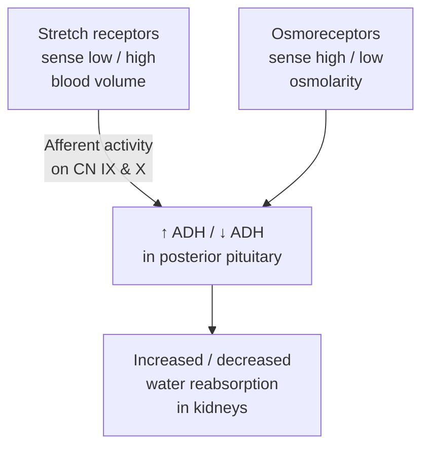

- Acts on [[collecting duct]] by inserting [[aquaporins]]

```mermaid
flowchart TD
    SR[Stretch receptors<br/>sense low / high<br/>blood volume]
    OR[Osmoreceptors<br/>sense high / low<br/>osmolarity]
    ADH[↑ ADH / ↓ ADH<br/>in posterior pituitary]
    H2O[Increased / decreased<br/>water reabsorption<br/>in kidneys]

    SR -->|Afferent activity<br/>on CN IX & X| ADH
    OR --> ADH
    ADH --> H2O
```
