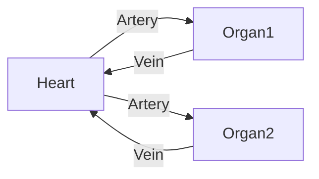

- A venule system that connects two organs directly to each other instead of first through the heart
- Usually, the circulation through an organ goes like this:

- So blood doesn't usually travel from one organ to the next
- In a portal system, like with the **hypophyseal portal system**, a venule system from the [[Hypothalamus|hypothalamus]] dumps into a [[capillary bed]] in the [[Anterior Pituitary]]